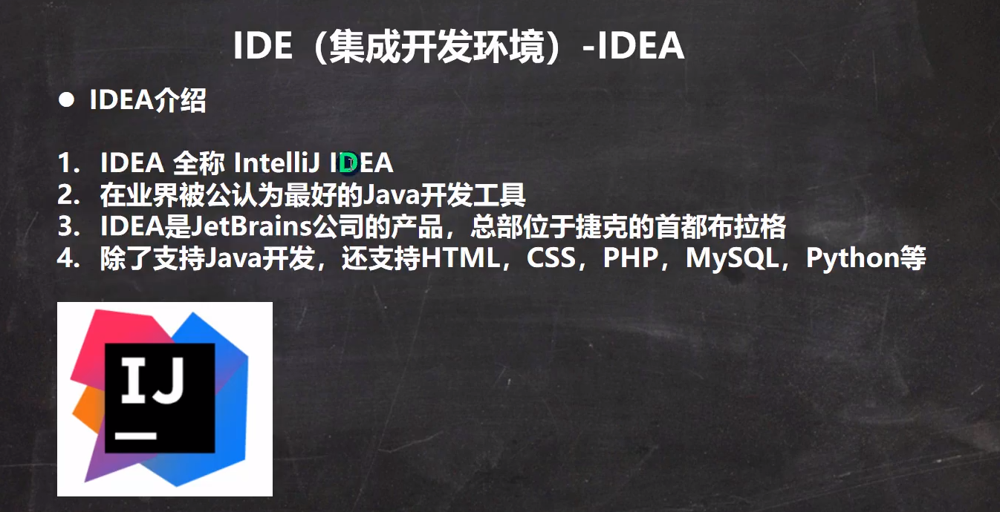

# Java-面向对象中级编程

#### IDEA（集成开发环境）：



#### Eclipse（集成开发工具）：


####  IDEA常用快捷键：


#### 包概念：


#### 包的三大作用：


#### 包的命名规则和规范：


#### Java中常用的包：


#### 如何引入包：


#### 包的使用细节：


#### 访问修饰符：


#### 面向对象的三大特征：


#### 封装：


#### 封装的好处：


#### 继承：


#### 继承的基本介绍：


#### 继承的便利：


```
在父类中增加一个方法，那么继承它的子类都会继承这个方法
```

#### 继承的细节：


```
super();关键字只能在构造方法中使用
```


```
8：构造器一直追溯到顶级父类
先执行Object 的构造器，在执行a的构造器，在执行b的构造器，最后执行c的构造器
```


#### 继承的本质：


```
package src.com.hspedu.extend_;
//继承的本质
public class ExtendsTherory {
    public static void main(String[] args) {
        Son son = new Son();//内存到底发生了什么
    }

}
class GanPa{
    String name="大头爷爷";
    String hobby="旅游";
}
class Father extends GanPa{//父类
    String name="大头爸爸";
    int age=39;
}
class  Son extends Father {//子类
    String name="大头儿子";
}
//如下图
1.第一个加载的是object类
2.第二个加载的是GanPa类
3.第三个加载的是Father类
4.最后加载Son类             他们之间会有一个关联关系，在方法区形成类和类的继承关系
5.在堆中分类内存空间，首先会给GanPa类分配空间，分配属性
6.再给Father类分配空间分配属性
7.最后给Son类分配空间分配属性
7.主空间分配给代码中的对象引用       在堆中分配空间，同名属性不冲突，整个对象还是叫Son

当子类对象引用访问对象中的属性的时候，是用什么规则访问的
```


```
//	访问属性，按照查找关系来返回信息
//   1.首先看子类的属性，看子类是否有该属性
//   2.如果子类有这个属性，并且可以访问，则返回信息
//   3.如歌子类没有这个属性，就看父类有没有这个属性（父类如果有并且可以访问，则返回信息）
//   4.如果父类没有，这按照3的规则继续找上一级父类，知道Object
```

#### super关键字：


#### super的使用细节：


#### 方法重写：


#### 方法重写的注意事项：


```
    子类方法返回类型和父类方法返回类型一致；
//  方法的返回数据类型是父类返回类型的子类  比如：父类返回object 子类返回 String也构成方法重写
```


#### 面向对象编程多态：


```
//多态提高代码的复用性
```


####  多态的使用细节：

向上转型：


```
父类引用指向子类对象，就是想上转型
Animal animal = new Dog();
可以的调用父类的所有方法但是需要遵守访问权限，但是不能调用子类特有的成员（方法和属性）
因为在编译阶段，能调用成员（方法和属性）是由编译类型来决定的
最终运行效果看子类的具体实现
```

向下转型：


```
Cat cat=(Cat) animal;
编译类型是 Cat 运行类型是 Cat
父类的引用必须指向的是当前目标类型的对象
```


```
public class Polydetail02 {
    public static void main(String[] args) {
        Base base=new sub();
        System.out.println(base.count);//10
        sub sub=new sub();
        System.out.println(sub.count);//20

    }
}
class Base{
    int count=10;
}
class sub extends Base{
    int count=20;
}
//访问属性直接看编译类型

```

```
public class PolyDetail03 {
    public static void main(String[] args) {
        BB bb = new BB();
        System.out.println(bb instanceof BB);//true
        System.out.println(bb instanceof AA);//true
//    编译类型是AA  运行类型是 BB  instanceof 判断对象的运行类似是否为某某类型货某某类型的子类
        AA aa = new BB();
        System.out.println(aa instanceof AA);
        System.out.println(aa instanceof BB);

    }
}
class AA{

}
class BB extends AA {

}
```

