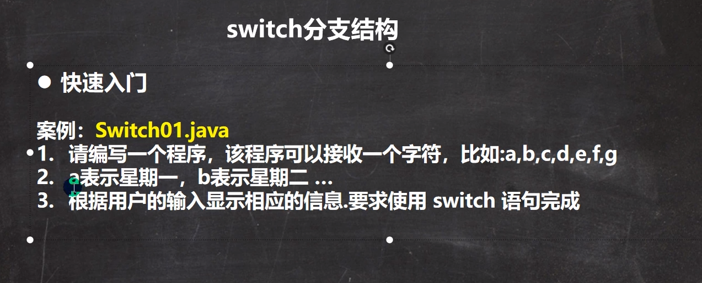

**JAVA-控制结构：**


**程序流程控制介绍：**


**顺序控制：**


**分支控制：**


1.单分支：分支控制if-else：


2.双分支：分支控制if-else


3.多分支：分支控制if-else if-else：


特别说明：1.多分支可以没有else，如果所有的条件表达式都不成立，则一个执行入口都没有

​					2.如果有elsel语句，如果所有的条件表达式都不成立，则默认执行else代码块

3.switch分支结构：


 Switch快速入门



```
在java中，只有有值返回，就是一个表达式
```

switch分支细节讨论：


```
case字句中的值必须是常量不能是变量
```

```
//switch 表达式中的返回值必须是：
// ('char、byte、short、int、Character、Byte、Short、Integer、String 或枚举')
```

```
//default子句是可选的，当没有匹配case时执行default
```

```
//break语句是执行完一个case分支后使程序跳出switch语句块，如果没有写break，程序会顺序执行到switch结尾
```


fot循环控制：

