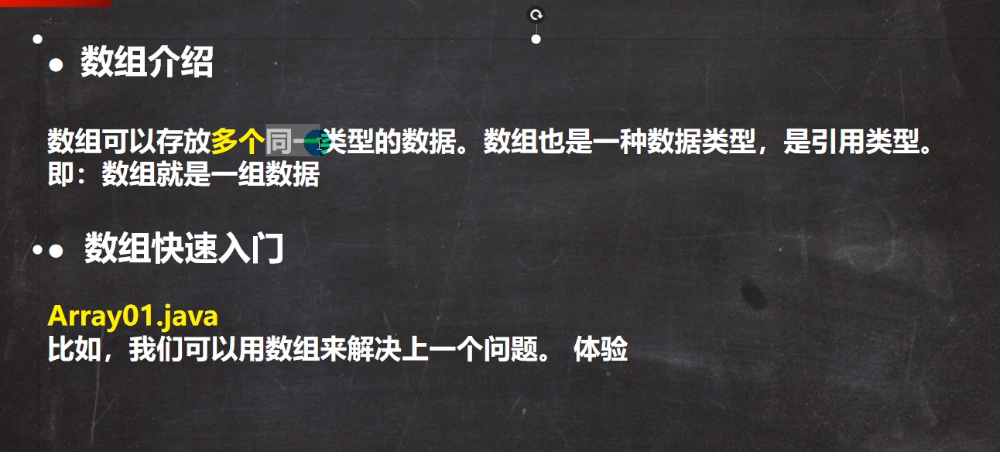
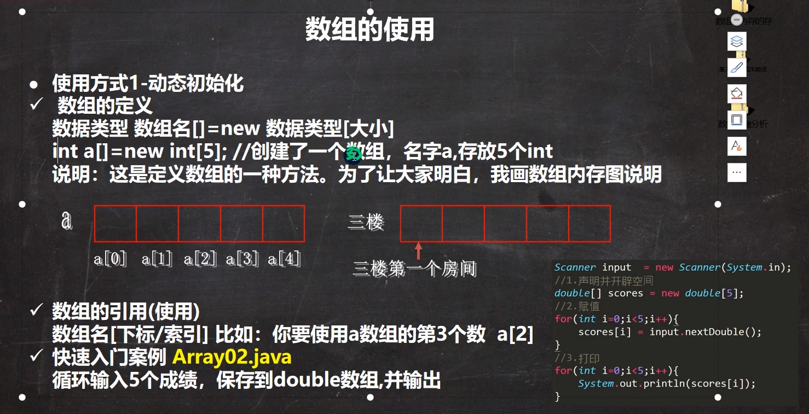
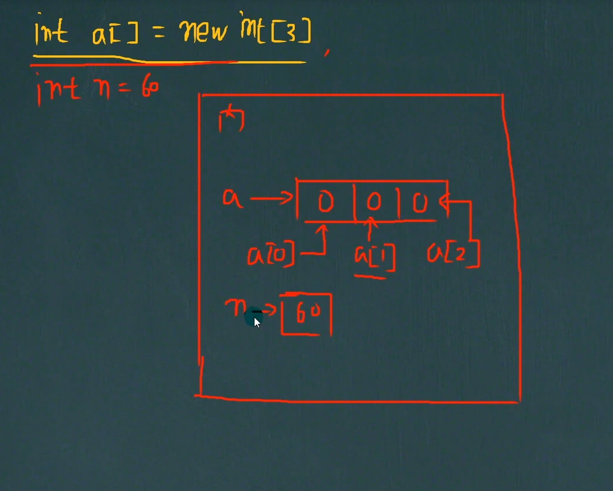

# **数组介绍**



```
package java_study;

public class ArrayTest {
    public static void main(String[] args) {
        //定义一个数组
        //double[]  表示duoble类型的数组，数组的名称是 hens
        //{3,5,1,3.4,2,50}  表示数组的值/元素,一次表示数组的第几个元素
        double[] hens={3,5,1,3.4,2,50};
//        变量数组得到数组的所有元素的和，使用for
//        通过数组hes[下标]来访问数组的元素
//        下标是从0开始编号的，比如第一个元素是hes[0]，第二个就是hes[1],以此类推
//        通过for循环可以循环的访问 数组的元素/值
//        在java中，可以通过数组名称.length 得到数组的大小长度
        double totalWeight=0;
        for(int i=0;i<6;i++){
            totalWeight+=hens[i];
        }
        System.out.println("总体重是："+totalWeight);
        System.out.println("平均体重是："+(totalWeight/6));
    }
}
```

## **数组的使用方式**：

#### **使用方法1-动态初始化**



```
1.中括号可以写在数据类型后面或者是写在数组名后面
2.初始化的内容根据不同数据类型使用不同的默认值 int：0 double：0.0 等等
3.数组的下标是从0开始的

        double[] chengJ=new double[5];
        Scanner scanner = new Scanner(System.in);
        for(int index=0;index<chengJ.length;index++){
            System.out.println("请输入第"+(index+1)+"个成绩");
            chengJ[index]=scanner.nextDouble();
        }
        for(int index=0;index<chengJ.length;index++){
            System.out.println("第"+(index+1)+"个成绩为："+chengJ[index]);
        }
    }
}
```



#### 使用方式2-动态初始化


```
int[] a;  先声明数组在new分配空间
a=new int[5];

```


#### 使用方式2-静态初始化


#### 数组的使用细节：


 

```
//        1.数组是多个相同类型的数据的组合，实现对这些数据的统一管理
        double[] arr1={2,3,4,5,1.1 };
//        2.数组中的元素可以是任何数据类型，包括基本数据类型和引用数据类型，但是不能混用
//        3.数组创建后，如果没有复制，有默认值
//        int 0，short 0，byte 0，,long 0,
        short arr[]=new short[3];
        for (int i=0;i<arr.length;i++){
            System.out.println(arr[i]);
        }
//        double 0.0，float 0.0;
//        char \u0000
//        boolean fales;
//        String null;
//        4.使用数组的步骤：先声明数组并开辟空间，给数组个个元素赋值，使用数组
//        5.数组的下标都是从0开始
//        6.数组的下标必须在制定的范围使用，否则会报 下标越界  最大下标 数组的长度-1
        System.out.println(arr[3]);
//        7.数组属于引用数据类型，数组型数据是对象（Object）
```

#### 数组的赋值机制


 
