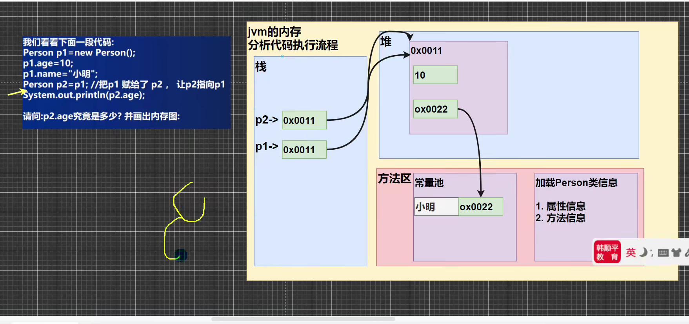
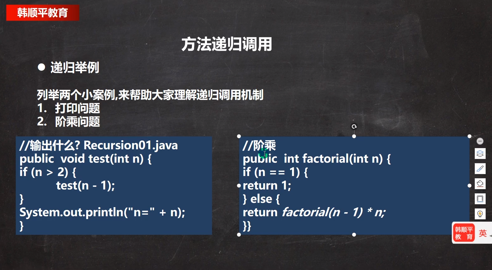

## 面向对象编程基础部分


#### 类与对象的概述：


```
1.对象主要是由:属性和行为组成的
```


```
1.类也是一种数据类型（自定义的数据类型）
2.对象就是一个具体的实例（事务）（通过类来创建一直具体的对象（一只具体的猫））
例如：人类（类） 对应具体的人，小明，小红，小刚（对象）
3.对象也是引用数据类型
4.String是引用数据类型
```

#### 类和对象的区别：


## 对象在内存中的存在形式：


```
1.在new的过程，会把我们类的信息加载到方法区
  加载Cat类信息：1.属性信息
  				//属性可以是基本数据类型，也可以是引用数据类型（对象和数组）
  		       2.行为（方法信息）
 2.真正的对象在堆中（包括方法区的数据），栈中的cat只是对象引用或对象名
 3.对象的默认值，与数组的一致
 4.只要有数据空间，就一定有地址
```


#### 属性和成员变量的概念：


field 字段

#### 属性的注意事项：


```
访问修饰符是控制属性的方位范围：
有4中访问修饰符，public ，proctected，private，默认
```

#### 创建对象的两种方式：


#### 如何访问属性：




#### Java内存的结构分析：

类与对象的内存分配机制：


#### 成员方法：


```
//    1.public 表示方法是公开的
//    2.void 表示方法没有返回值
//    3.speak表示方法名，()形参列表
//    4.{}方法体，可以写我们要执行的代码 相关的功能
//    方法写好后如果不去调用不会输出
    public void speak(){
//        我们的方法就是输出一句话,.System.out.println("我是一个好人")
        System.out.println("我是一个好人");
    }
}
```

#### 方法的调用机制：


* return语句返回以后，getSum的空间就被释放了，就没有了

#### 成员方法的必要性：

```
方法的好处：
1.提高的代码的复用性
2.可以将实现的细节封装起来，然后供其他用户来调用即可
```

#### 成员方法的定义：


#### 成员方法的注意事项与细节：


#### 成语方法的传参机制：


#### 方法递归调用：





```
//画内存分析法明白了
//猴子吃桃子问题
public int peach(int day) {  //8
    if (day == 10) {
        return 1;
    } else if (day >= 1 && day <= 9) {
        return (peach(day + 1)      + 1) * 2;
    } else {
        System.out.println("输入的天数不对");
        return -1;
    }


}
```

****

```
 //思路：
        //1.先创建迷宫，int[][] map=new int[8][7];
        //2.现规定map数组的元素，0是可以走，1是强
```


//后期算法讲


####   方法重载（OverLoad）：


