# JAVA面向对象高级：

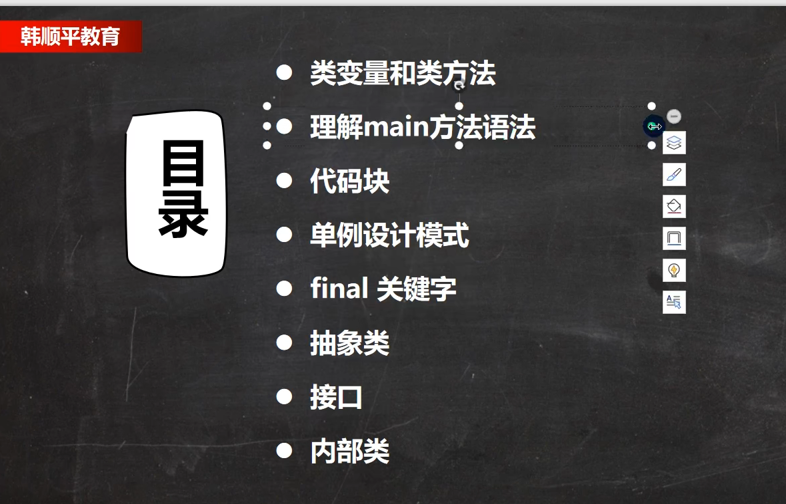

#### 类变量：


```
//    定义一个类变量，是一个静态变量，static修饰
//    该变量最大的特点是会被Child 类的所有对象实例共享
static变量是所有对象共享的（同一个类的所有对象）
```

类变量内存解析：


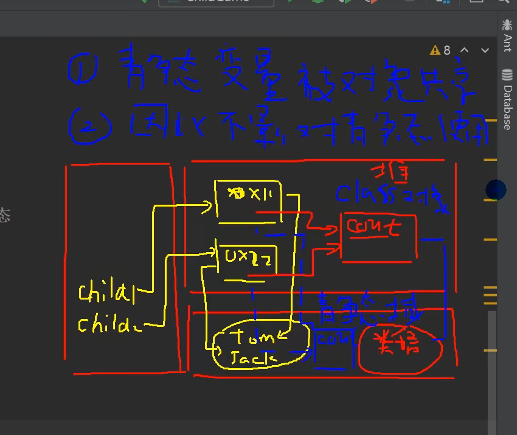

```
//count存放在内存堆空间中（单独空间），类加载的时候会在堆中创建对应的class对象
//内存方法区中有一个空间是静态域，静态属性在静态域中
多种说法，*根据不同jdk版本存放不同的位置
//静态变量是所有对象实例共享的
//静态变量（static变量）是在类加载的时候生成创建
类变量是随着类的加载而创建，所以没有创建实际对象也可以访问
static变量是所有对象共享的（同一个类的所有对象）
```

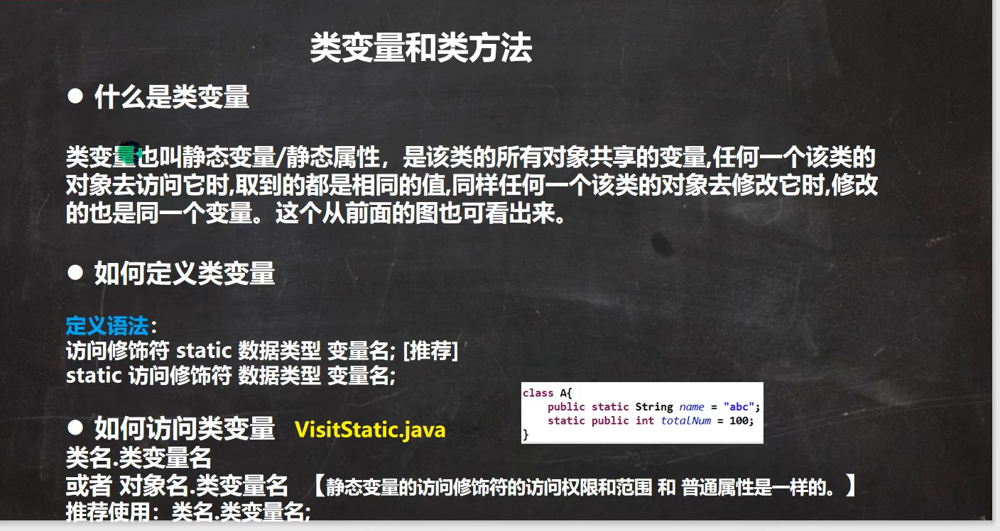

```
类变量的访问，必须遵守，相关的访问权限
```

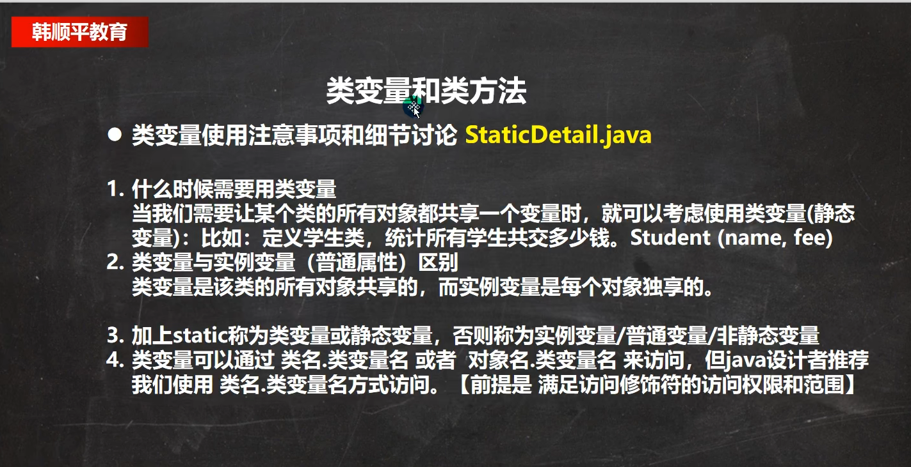


#### 类方法：

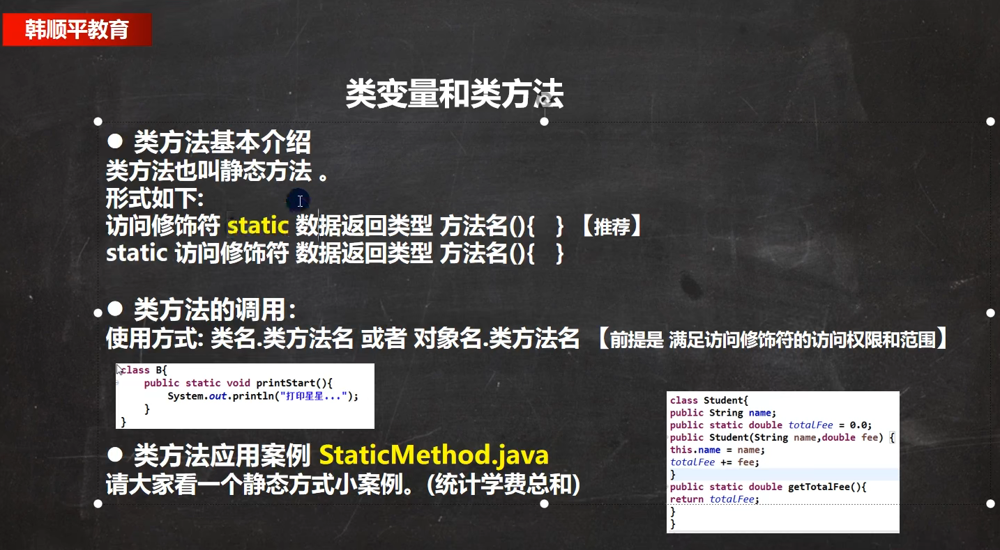

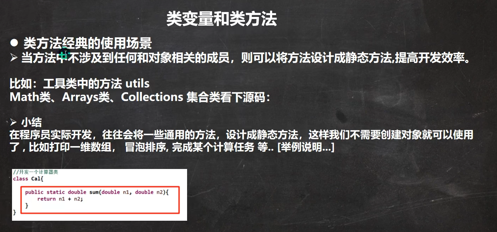

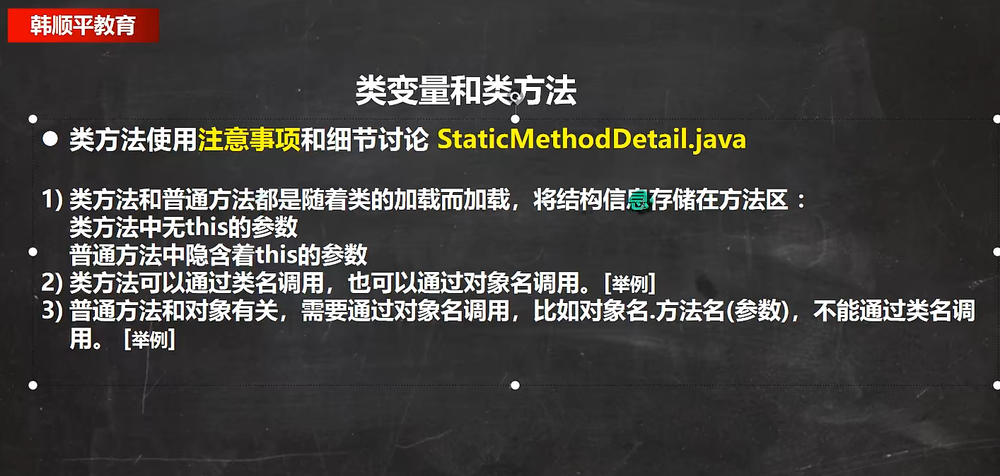

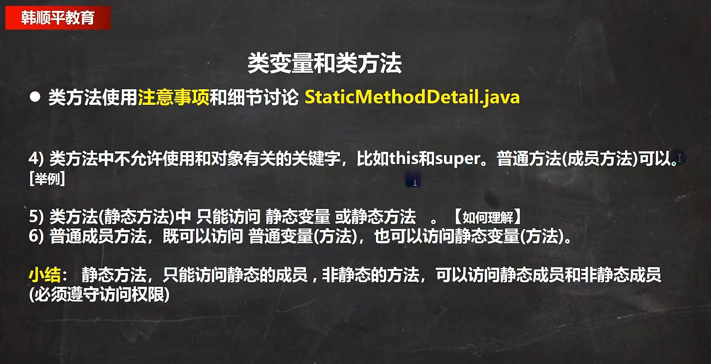

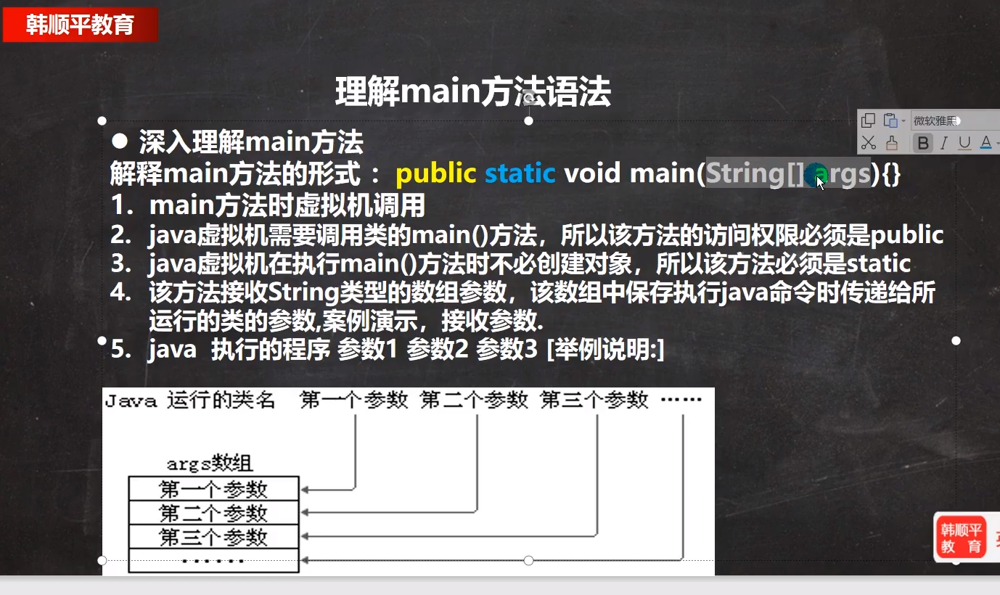

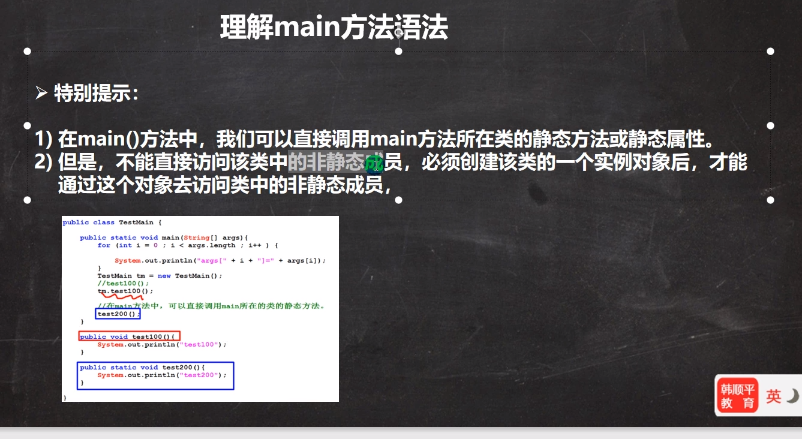


#### 代码块：

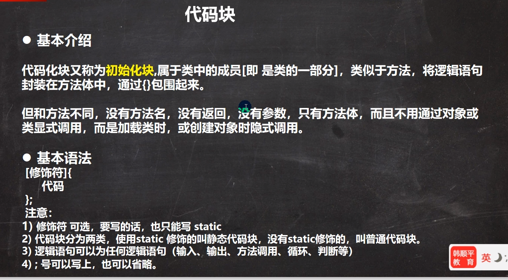

