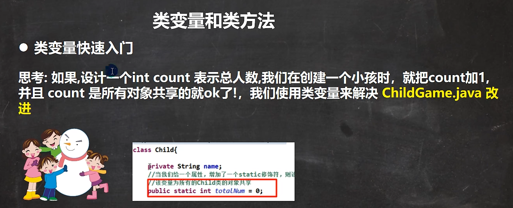
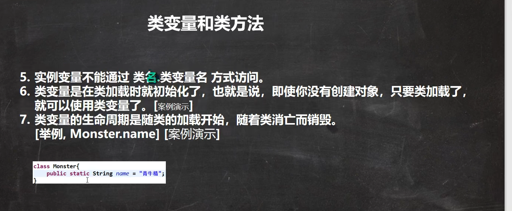
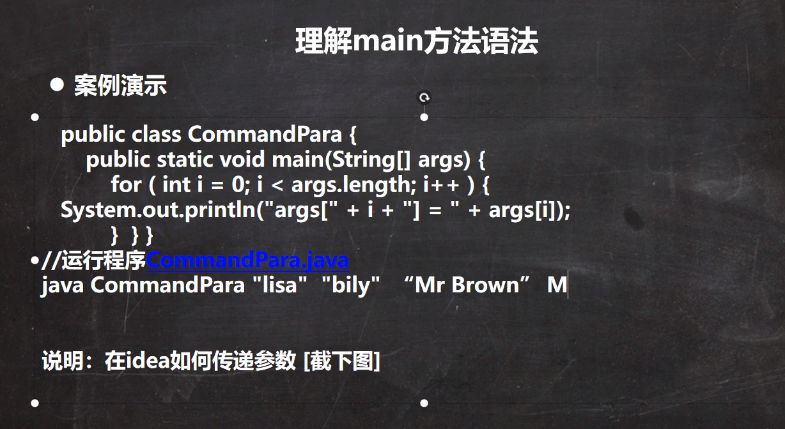
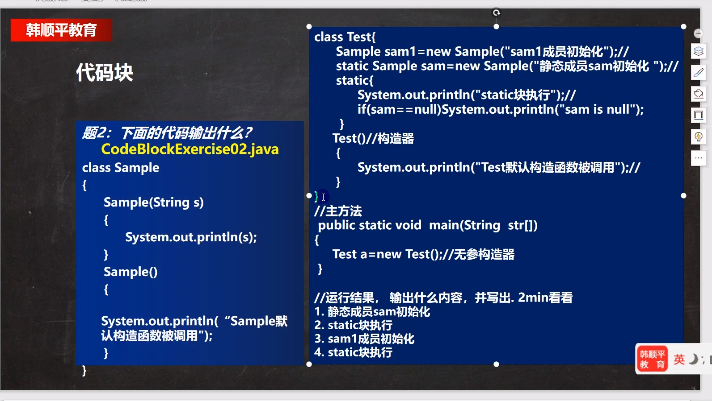
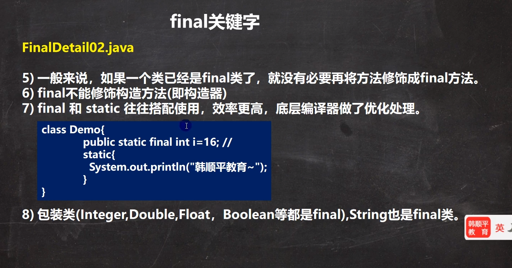
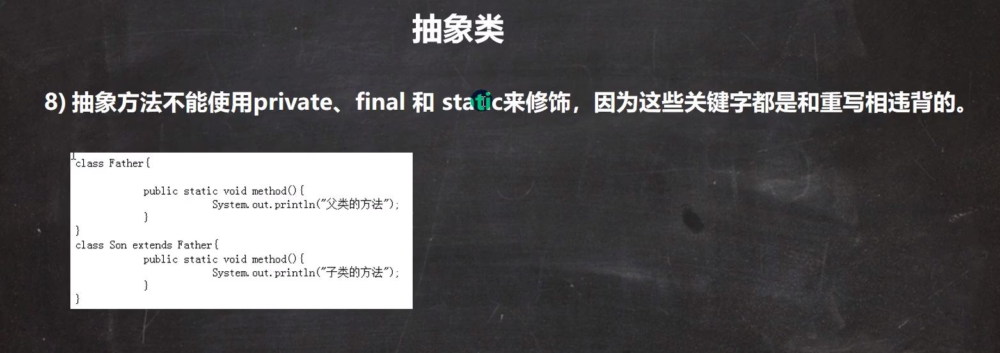
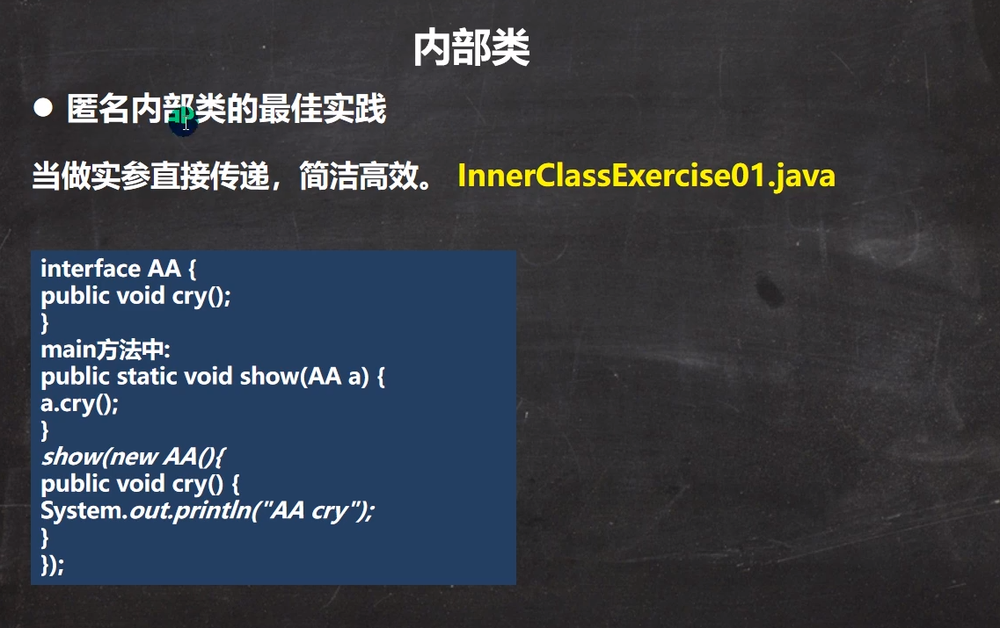
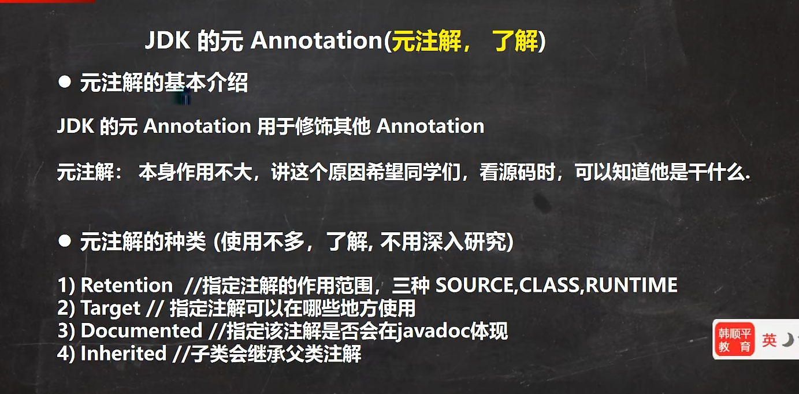
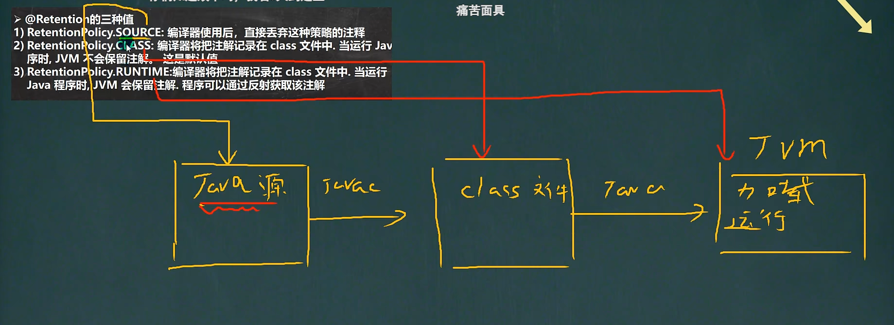
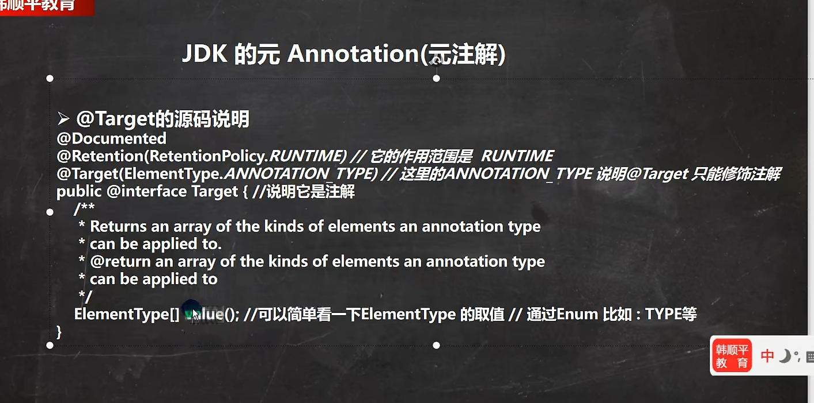

#  JAVA面向对象高级：


#### 类变量：




```
//    定义一个类变量，是一个静态变量，static修饰
//    该变量最大的特点是会被Child 类的所有对象实例共享
static变量是所有对象共享的（同一个类的所有对象） 
```

类变量内存解析：


```
//count存放在内存堆空间中（单独空间），类加载的时候会在堆中创建对应的class对象
//内存方法区中有一个空间是静态域，静态属性在静态域中
多种说法，*根据不同jdk版本存放不同的位置
//静态变量是所有对象实例共享的
//静态变量（static变量）是在类加载的时候生成创建
类变量是随着类的加载而创建，所以没有创建实际对象也可以访问
static变量是所有对象共享的（同一个类的所有对象）
```


```
类变量的访问，必须遵守，相关的访问权限
```




#### 类方法：





#### 代码块：




#### 单例设计模式：


#### 单例（单个的实例）


```
构造器私有化，防止直接new
饿汉式：有可能还没有用到对象，对象就被创建好了，在类加载的时候对创建了
使用单例模式的对象通常都是重要级的对象，饿汉式可能造成创了对象但是没有使用
```


```
懒汉式：在使用的时候创建对象
懒汉式：只用在当用户使用getInstance，才返回cat对象
```


#### final关键字：








5.内部类

#### 内部类：


1.本质是类，

2.内部类

3.没用类名





 


#### 枚举：


枚举第二种方式：


Javap 反编译：把class文件编译成java文件


#### 注解：


```
//     @Override放在say方面上面表示子类重写了父类的say方法
//    这里如果没有写 @Override的注解 那么他还是重新了父类方法
//    如果写了 @Override 编译器就会去检查该方法是否真的重写了父类的某方法
//    如果的确重写了则编译通过，如果没有构成重写则编译错误
    /*
       如果看到 @interface 表示一个 注解类
     @Target(ElementType.METHOD)
     @Retention(RetentionPolicy.SOURCE)
        public @interface Override {
    }
    */
```


```
//@Deprecated 修饰一个元素表示该元素已经过时了
// 既不在推荐使用，但是仍然可以使用
```











